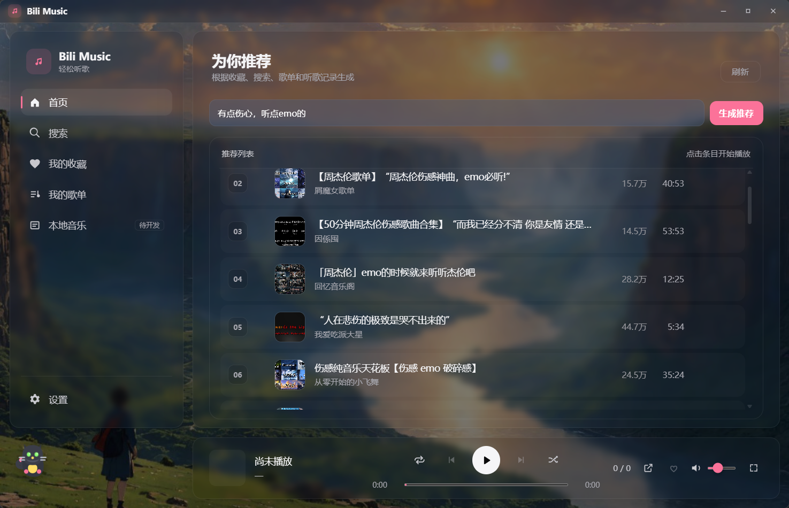

<div align="center">
  

  <h1>Bili Music · 午夜黑胶</h1>

  <p>一个免登录、不落盘的 B 站音乐播放器。把哔哩哔哩当作你的曲库，听歌不必登录，不必下载。</p>

  <p>
    
    
    
    
  </p>
  
</div>

---

> ⚠️ **非官方项目**：本项目与哔哩哔哩（bilibili）没有任何官方关联或背书，仅供个人学习与研究使用。详见文末 [法律声明](#法律声明与使用限制)。

## ✨ 这是什么

Bili Music 是一个基于 **Tauri v2 + Rust** 的桌面音乐播放器，把 B 站音乐区当作曲库来听歌。它和市面上同类工具最大的不同，在于两条贯穿始终的设计原则：

- 🔒 **免登录**：默认走游客身份取流与搜索，全程不需要账号 `cookie`，没有封号顾虑。
- 💧 **不落盘**：音频通过本地流代理在线播放，不下载，不缓存到磁盘，听完即走。

换句话说，它刻意没有走“登录账号 + 下载到本地”那条更省事、但更有风险的路，而是把“零负担、零配置、隐私友好”作为产品核心。

## 🎧 核心特性

| 功能 | 说明 |
| --- | --- |
| 🔎 音乐搜索 | B 站音乐区搜索，支持 6 个子分区筛选，支持粘贴 BV 号直接播放 |
| 📈 首页榜单 | 打开即见“音乐飙升榜”，游客身份直拉 B 站音乐区排行 |
| 🎵 在线流式播放 | 后端 Axum 流代理，透传 `Range`，边下边播，不落盘 |
| 📼 合集连播 | 多 P 视频可自动顺序连播，标题跟随当前分 P 切换 |
| ❤️ 收藏与歌单 | 本地 JSON 持久化收藏与自建歌单，原子写入，坏文件不覆盖 |
| 🪞 沉浸播放页 | 全屏封面、镜面倒影、与底部播放条共享同一套播放器状态 |
| 🌘 午夜黑胶主题 | 深色 / 浅色 / 背景图三档主题，保留克制的玻璃质感 |
| 🪟 原生质感 | 自定义无边框标题栏，整体更像桌面应用而不是浏览器壳 |

## 🧠 技术亮点

> 这一节写给技术读者：项目里几个有意思的工程决策与难点。

### 1. 免登录游客取流

常见方案是登录账号，再用 `yt-dlp --cookies` 解析下载。本项目改成 **游客身份** 直接领取 `buvid` 票据，经 WBI 签名请求 `playurl` 拿到音频直链，全程不依赖登录态。

性能上也明显更快：

| 方案 | 首播耗时 |
| --- | --- |
| `yt-dlp`（旧方案，需 cookie） | ~12.79s |
| 游客直链（冷启动） | ~1.83s |
| 游客直链（热态） | ~0.54s - 0.91s |

`yt-dlp` 仍作为 **可选兜底** 保留，只在极少数游客取流失败时启用；默认分发版本不包含它，保持“双击即用”。

### 2. 真实风控场景下的游客搜索

无 `cookie` 首次搜索时，曾遇到返回 `v_voucher` 而不是正常数据。最终定位到根因是游客身份只拿到了 `buvid3`、缺了 `buvid4`。修复策略不是“强行上登录态”，而是把游客身份补领逻辑改成“缺任一项都走 SPI 补齐”。

这类问题没有现成模板，价值就在于把真实风控行为摸清、再最小代价地兼容掉。

### 3. 搜索展示与播放队列解耦

早期有个很烦的行为：一搜索，就会打断当前播放。根因是“搜索结果列表”和“真实播放队列”绑死了。

现在拆成两套状态：

- `searchState.results`：只负责右侧展示。
- `playerState.queue`：只负责真实播放。

结果是：搜索只更新展示；只有点中某首歌时，才把当前展示列表升级成播放队列。这个解耦也顺带让首页榜单、收藏、歌单都能复用同一套播放状态机。

### 4. 切歌不串台

快速切歌时，旧请求可能在新请求之后才返回，污染当前播放。这里用了 `requestVersion` 作为请求代号，并在登记代理 URL 前再做一次当前任务身份校验，确保迟到的旧结果一律作废。

这样既能避免串台，也能正确区分“真实解析失败”和“用户主动切歌取消”。

### 5. 多 P 合集的最小侵入接入

B 站大量音乐资源本质上是多 P 合集。项目没有去推翻既有按 `BV` 组织的播放队列，而是旁挂分 P 游标和显示层快照，让“当前播放推进”和“当前标题显示”理解分 P 的存在即可。

这保证了多 P 连播能接进来，同时不破坏已经稳定的队列、随机、循环、失败跳过逻辑。

### 6. 本地数据原子写入

收藏、歌单、搜索历史都落在本地 JSON。写入走原子方案：临时文件、备份、再重命名，并处理 Windows 下重命名不能直接覆盖现有文件的细节。读取时如果文件损坏，会显式报错，但绝不会拿空数据覆盖掉坏文件。

## 🔧 技术栈

- **框架**： [Tauri v2](https://tauri.app/)
- **后端**：Rust + Cargo workspace + Axum 本地流代理
- **前端**：原生 HTML / CSS / JavaScript
- **取流**：游客直链为主，[yt-dlp](https://github.com/yt-dlp/yt-dlp) 可选兜底
- **本地数据**：JSON（收藏、歌单、搜索历史）

> B 站接口整理参考了 [SocialSisterYi/bilibili-API-collect](https://github.com/SocialSisterYi/bilibili-API-collect)，在此致谢。

## 📦 安装与运行

> ⚠️ **平台说明**：目前仅在 **Windows 10 / 11** 上开发与验证。macOS / Linux 理论上 Tauri 可支持，但**未经测试**。

### 方式一：直接下载使用

前往 [Releases](https://github.com/Jmiao11/bili-music/releases) 下载最新免安装版 `Bili Music.exe`，双击即可运行。

- 默认就是纯游客模式，无需任何配置、无需登录。
- 收藏、歌单、搜索历史会保存在 **exe 同目录**。

### 方式二：从源码构建

#### 1. 前置依赖

| 依赖 | 说明 |
| --- | --- |
| [Rust](https://www.rust-lang.org/tools/install) | Edition `2021` |
| [Node.js](https://nodejs.org/) | 用于本地 Tauri 开发环境，建议 LTS |
| [Tauri CLI](https://tauri.app/) | `cargo install tauri-cli` |
| WebView2 Runtime | Windows 10/11 通常已自带；缺失时从微软官网安装 |

#### 2. 克隆并运行

```bash
git clone https://github.com/Jmiao11/bili-music.git
cd bili-music

# 开发模式
cargo tauri dev

# 构建免安装 exe
cargo tauri build
```

构建产物位于 `target/release/`。

#### 3. 可选：启用 `yt-dlp` 兜底

默认游客模式已经能正常使用。若希望在极少数游客取流失败时保留兜底：

1. 下载 [`yt-dlp.exe`](https://github.com/yt-dlp/yt-dlp/releases)，放到 exe 同目录；开发模式下放到项目根的 `tools/yt-dlp.exe`。
2. 如该兜底需要 `cookie`，将 `cookies.txt`（Netscape 格式）放到同一目录。

> 🔒 `cookies.txt` 含登录态，已被 `.gitignore` 忽略，请勿提交。`yt-dlp` 兜底只用于覆盖极个别游客无法取流的视频，并非必需。

## 🗂 项目结构

- `src/`
  - Rust 核心库
  - 负责取流地基与 `yt-dlp` 解析复用
- `src-tauri/`
  - `src/main.rs`：Tauri 入口、命令注册、播放取消协调
  - `src/guest_playurl.rs`：游客取流（`buvid` / `playurl`）
  - `src/wbi.rs`：WBI 签名（搜索与 `playurl` 共用）
  - `src/search.rs`：搜索
  - `src/ranking.rs`：首页榜单
  - `src/library.rs`：收藏 / 歌单 / 搜索历史
  - `src/appearance.rs`：主题 / 背景图
  - `tauri.conf.json`：Tauri 配置
- `ui/`
  - `index.html`：主界面结构
  - `main.js`：播放队列、搜索、收藏、歌单、多 P 连播
  - `appearance.js`：主题、设置、沉浸页
  - `window-controls.js`：自定义标题栏窗口控制
  - `styles.css`：样式
- `design/`
  - “午夜黑胶”设计稿与规范
- `AGENTS.md`
  - 项目“宪法”：模块边界与关键约束

## ⚖️ 法律声明与使用限制

- 本项目为**非官方**第三方客户端，与哔哩哔哩（bilibili）无任何官方关联或背书，不使用其商标与标识；相关名称与商标归各自权利人所有。
- 本项目**仅供个人学习与研究使用**，**禁止任何形式的商业用途**，包括但不限于销售、收费服务、广告变现、商业集成等。
- 本项目**不下载、不存储**任何音视频内容到磁盘，仅做在线播放；不绕过登录 / 会员权限，不破解任何 DRM 或加密措施。
- 数据来源于公开接口；使用时须遵守哔哩哔哩的《用户协议》《社区规则》及相关法律法规，不得用于批量爬取、恶意抓取等违反平台规则的行为。
- 使用本项目所产生的一切风险与责任由使用者自行承担；如权利人认为项目存在侵权或合规问题，请通过 Issue 联系，我会及时处理。

## 📜 许可证

本项目采用 **[PolyForm Strict License 1.0.0](https://polyformproject.org/licenses/strict/1.0.0/)** 发布，仅限个人非商业使用，不允许商业用途、再分发或修改后再分发。

<div align="center">
  <sub>由 Tauri + Rust 构建 · 仅供学习研究 · 如果这个项目对你有帮助，欢迎 Star</sub>
</div>
